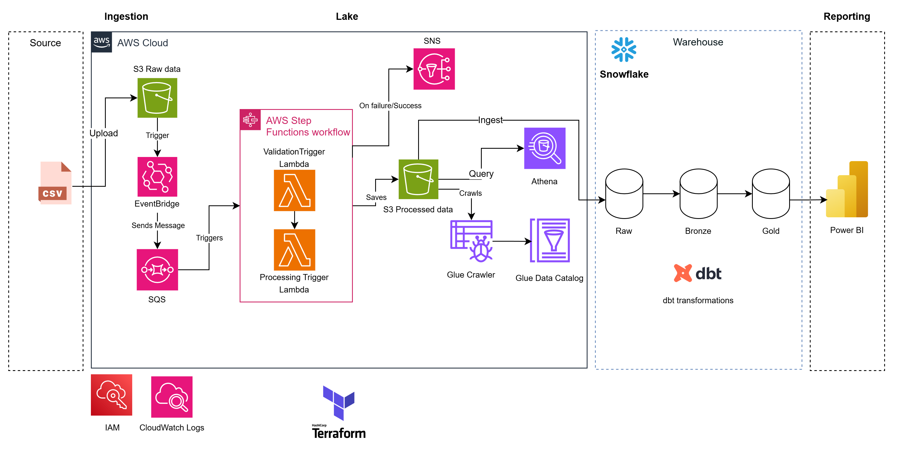
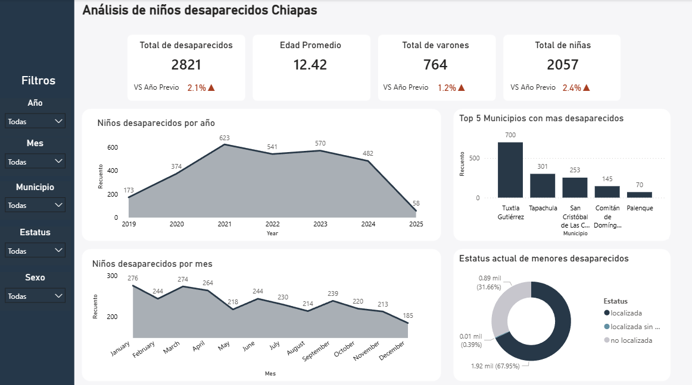

# End-to-End Data Pipeline for Missing Kids in Chiapas, Mexico

## Table of Contents
- [Project Overview](#project-overview)
- [Dataset Description](#dataset-description)
- [Methodology/Process](#methodologyprocess)
- [Dashboard/Results](#dashboardresults)
- [Technologies Used](#technologies-used)

## Project Overview
Missing Kids Pipeline is a serverless, event-driven data platform on AWS and Snowflake that ingests CSV files about missing persons in Chiapas, Mexico, validates data quality, transforms the records into partitioned Parquet, loads curated datasets into Snowflake, and uses dbt to build the analytical layer for visualization in tools like Power BI or QuickSight. Additionally, Terraform is used to provision and manage all the AWS resources.

*Figure 1. Serverless architecture and data flow.*

## Dataset Description
The source dataset is a CSV file (e.g., `base-desapariciones-dataton-2025.csv`) containing records of missing children in Chiapas from 2019 to 2025. Key fields include sex, age, age group, municipality, region, neighborhood/locality, migrant status, disappearance date, day of week, time-of-day, case status, and days missing.

## Pipeline Flow
1. CSV files are uploaded to `raw/` in an S3 bucket.
2. EventBridge triggers an SNS topic that fans out to SQS.
3. A starter Lambda kicks off an AWS Step Functions workflow.
4. The validator Lambda checks required columns and enforces a data quality threshold (>70% valid rows).
5. The transformer Lambda cleans fields (dates, ages, time-of-day, location splits) and writes partitioned Parquet (`year=YYYY`) to a processed bucket.
6. A Snowflake loader ingests the processed parquet files into Snowflake for downstream analytics.
7. dbt models and tests shape the analytical layer on Snowflake for BI-ready marts.
8. Glue Crawlers update the data catalog for Athena queries, while failures are routed to a DLQ and alert through CloudWatch/SNS.

## Dashboard/Results
The processed data can be queried in Athena and Snowflake, then connected to Power BI or QuickSight to build dashboards that highlight missing-person trends by municipality, age group, time period, and case status. dbt provides the semantic and dimensional modeling that keeps the analytics layer consistent.

*Figure 3. Power BI dashboard.*

## Technologies Used
- AWS S3, EventBridge, SNS, SQS
- AWS Lambda, Step Functions
- AWS Glue, Athena
- Snowflake, dbt
- Terraform
- Python, pandas, awswrangler
- Power BI
